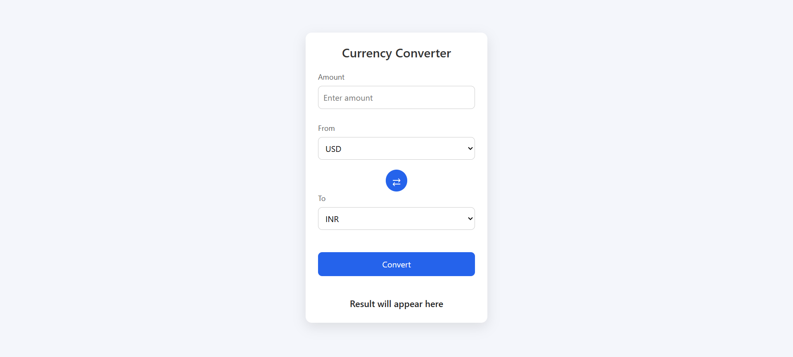

# 💱 Currency Converter

A simple and clean **Currency Converter web app** built using **HTML, CSS, and JavaScript**.  
It fetches real-time exchange rates from an API and allows users to convert between different currencies easily.

---

## 🌍 Preview

---

## 🔗 Live Demo
![View Live] (https://mahir9104.github.io/currency-converter/)

---

## 🚀 Features

- 🌍 Live currency exchange rates (API based)
- 🔁 Swap currencies with one click
- ⌨️ Press **Enter** to convert
- ✅ Input validation (invalid values)
- ⏳ Loading indicator while converting
- 🎨 Clean & responsive UI
- ⭐ Default USD → INR selection
- 🧠 Beginner-friendly logic

---

## 🧪 API Used
https://api.exchangerate-api.com/v4/latest/USD

---

## 🛠️ Technologies Used

- HTML5  
- CSS3  
- JavaScript (ES6)
- Fetch API  

---

## 📂 Project Structure
currency-converter/
│
├── index.html
├── style.css
├── script.js
├── images/
│ └── favicon.png
└── README.md

---

## 👨‍💻 Author

# Mahir Panchal 
- Learning **Full-Stack** Web Development.
- Focused on JavaScript & real-world projects.

⭐ If you find this project helpful, consider giving it a star!

---

## 📜 License

This project is free to use for learning and practice.

---
